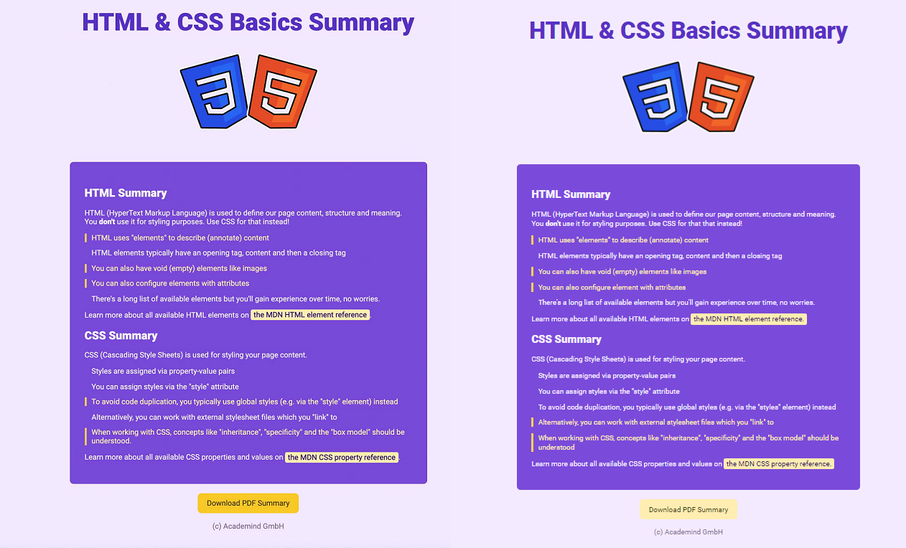

# **Day 10** <!-- omit in toc -->

1. [**Target Attribute of Anchor tag**](#target-attribute-of-anchor-tag)
2. [**Making Text Bold**](#making-text-bold)
   1. [**Using CSS**](#using-css)
3. [**B tag**](#b-tag)
4. [**EM tag**](#em-tag)
5. [**Strong tag**](#strong-tag)
6. [**Reference**](#reference)
7. [**Final Output**](#final-output)
8. [**Comparison**](#comparison)

---

## **Target Attribute of Anchor tag**

-   Target is by default set to `_self` by the browser which opens the external resource (link) in the same tab.
-   You can however set it to `_blank` if you want it to open in a new tab.

```html
<a href="YOUR_LINK_HERE" target="_blank">YOUR TEXT FOR THE LINK</a>
```

---

## **Making Text Bold**

-   There are few approaches to emphasis your text.

### **Using CSS**

-   While it visually looks bold, screen readers won't understand it.

```html
<p>This is a <span>Bold</span> text.</p>
```

```css
span {
    font-weight: bold;
}
```

## **B tag**

```html
<p>This is a <b>Bold</b> text.</p>
```

## **EM tag**

-   It emphasis the text.
-   Screen reader will slightly change the voice while reading it.

```html
<p>This is a <em>Bold</em> text.</p>
```

## **Strong tag**

-   It strongly emphasis the text.
-   Screen reader will raise the voice while reading it.

```html
<p>This is a <strong>Bold</strong> text.</p>
```

---

## **Reference**


## **Final Output**


## **Comparison**


