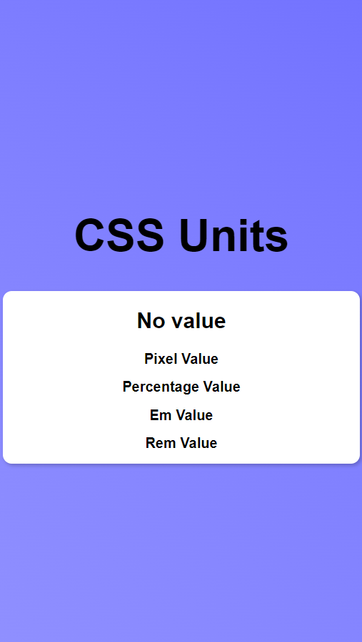
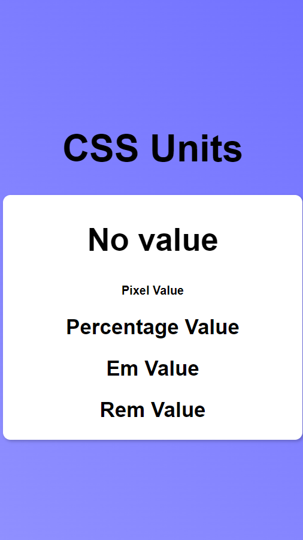

# **Day 21** <!-- omit in toc -->

1. [**Responsive Design**](#responsive-design)
2. [**CSS Units**](#css-units)
   1. [**Pixels (px)**](#pixels-px)
   2. [**Percentages (%)**](#percentages-)
   3. [**Emphemeral Unit (em)**](#emphemeral-unit-em)
   4. [**Root Emphemeral Unit (rem)**](#root-emphemeral-unit-rem)
3. [**Difference Between Units**](#difference-between-units)

## **Responsive Design**

-   Design that adapts different device sizes.

## **CSS Units**

### **Pixels (px)**

-   Easy to understand & translatable.
-   Limited user focus & not scalable.
-   Elements that doesn't have any fixed font-size can get scaled depending on the user's browser setting by using customized fonts.

### **Percentages (%)**

-   Relative to the parent element size.
-   Hard to manage due to cascading nature.

### **Emphemeral Unit (em)**

-   Size is relative to font-size.
-   Hard to manage due to cascading nature.

### **Root Emphemeral Unit (rem)**

-   Size is relative to root element's font-size. i.e. html element.
-   Preferred choice if applicable.

## **Difference Between Units**

**HTML**

```html
<div id="container">
    <h2 id="no">No value</h2>
    <h2 id="px">Pixel Value</h2>
    <h2 id="pc">Percentage Value</h2>
    <h2 id="em">Em Value</h2>
    <h2 id="rem">Rem Value</h2>
</div>
```

**CSS**

```css
#container {
    width: 400px;
    border-radius: 10px;
    background-color: white;
    box-shadow: 2px 2px 4px rgba(0, 0, 0, 0.2);
}

#px {
    font-size: 16px;
}

#pc {
    font-size: 100%;
}

#em {
    font-size: 1em;
}

#rem {
    font-size: 1rem;
}
```

**Output based on Browser font settings**
| | 16px | 28px |
| :-- | :--------------------------: | :--------------------------: |
| |  |  |
