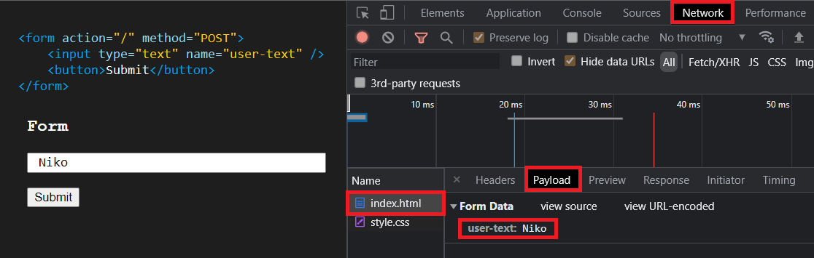

# **Day 26** <!-- omit in toc -->

1. [**Forms**](#forms)
   1. [**What & Why?**](#what--why)
   2. [**Examples of Forms**](#examples-of-forms)
2. [**HTML Elements**](#html-elements)
   1. [**Input**](#input)
   2. [**Textarea**](#textarea)
   3. [**Select**](#select)
   4. [**Button**](#button)
   5. [**Using Forms**](#using-forms)
3. [**Types of Requests**](#types-of-requests)
   1. [**GET**](#get)
   2. [**POST**](#post)

## **Forms**

### **What & Why?**

-   Allows User to Enter Data.
-   Many websites not only shows the data but also accepts the input form the users.
-   There are special HTML elements for getting and handling user input.

### **Examples of Forms**

-   Contact Form
-   Checkout Form
-   Login Form
-   Comment Form

---

## **HTML Elements**

### **Input**

-   Accepts the single line input.
-   Tag: `<input type="...">`
-   `type` attribute controls the input type to be shown. eg. single line text, phone number, number, range, email, etc.
-   `name` attribute allows you to add a unique identifier to the element.

```html
<input type="text" name="user-text" />
```

### **Textarea**

-   A multi-line text input field.
-   Tag: `<textarea>`

### **Select**

-   Used for dropdown, multi-choice or multi-select input.
-   Tag: `<select>`

### **Button**

-   Most important element in the form.
-   Used for confirming the collected input data.
-   Can be used to reset or submit the form.
-   Tag: `<button>`

```html
<button>Submit</button>
```

### **Using Forms**

```html

```

-   `action` attribute is used to define the URL where the request should be submitted.
-   `method` attribute defines the type of request to be sent to the server. It can be a `GET` or `POST` method.

---

## **Types of Requests**

-   They are the standard methods used by the browser for transferring the data.

### **GET**

-   Default method of the form.
-   Used to serve a page or content based on the given inputs.
-   Value of the inputs gets added in the URL as a query to get transferred between pages.
-   It can bee seen in `Developer Tools` -> `Network` -> `Payloads` -> `Query String Parameters`.
-   `&` is used to separate between different inputs.

```html
<form action="/" method="GET">
    <input type="text" name="user-text" />
    <button>Submit</button>
</form>
```


### **POST**

-   Used to store the data sent by the user.
-   Data being transferred isn't directly visible.
-   It can bee seen in `Developer Tools` -> `Network` -> `Payloads` -> `Form Data`.

```html
<form action="/" method="POST">
    <input type="text" name="user-text" />
    <button>Submit</button>
</form>
```


