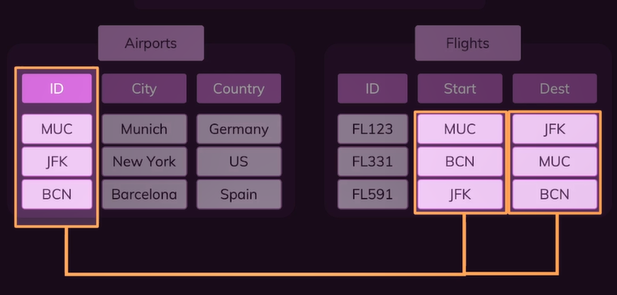
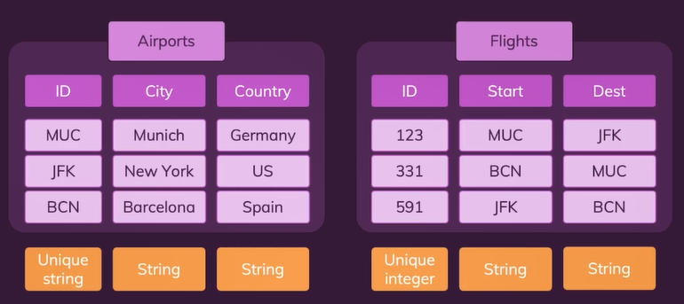
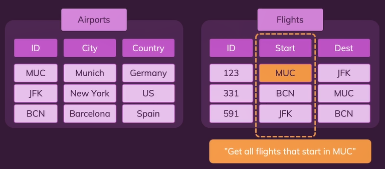
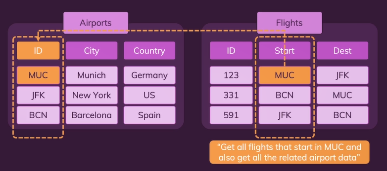
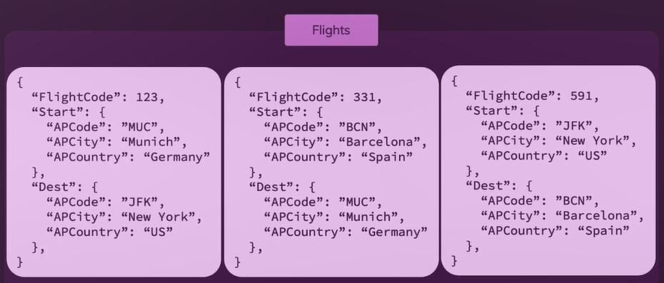
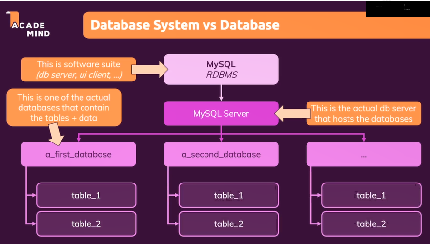

# **Day 57** <!-- omit in toc -->

1. [**Introduction**](#introduction)
   1. [**SQL Databases**](#sql-databases)
   2. [**NoSQL Databases**](#nosql-databases)
   3. [**SQL vs NoSQL**](#sql-vs-nosql)
2. [**SQL Databases**](#sql-databases-1)
   1. [**What?**](#what)
   2. [**Setting Up**](#setting-up)
      1. [**Installation**](#installation)
      2. [**Start/Stop the Server**](#startstop-the-server)
      3. [**Usage**](#usage)
   3. [**Database Systems vs Databases**](#database-systems-vs-databases)
   4. [**Creating Schema**](#creating-schema)

## **Introduction**

### **SQL Databases**

-   Store normalized data across multiple tables.
-   Tables have clear schemas and data types.
-   Data and relations can be queried.

-   **Normalized** - Every column only has one value per row.

**Relationship between Tables**


**Table Schema**


**Queries**



### **NoSQL Databases**

-   Data is stored in only a few tables which each contain more information.
-   More data can be fetched with fewer queries.
-   There are no columns, instead there are objects/documents.
-   There is no fixed schema.
-   Performance increases due to less nested queries.
-   Size of the data increases.



### **SQL vs NoSQL**

-   No Winner.
-   Both can be used for any given use-cases.
-   Think about the queries.
-   SQL provides more structure and rules. Scalability issues.
-   NoSQL can be more flexible and reduces amount of required queries.

---

## **SQL Databases**

### **What?**

-   Originally called _"Sequel"_
-   Now stands for _**S**tructured **Q**uery **L**anguage_
-   Language for communicating with Relational Databases.
-   Strict schema, data structure across multiple tables.
-   Tables entries can be connected via unique identifiers.
-   Data can be inserted or retrieved via SQL statements.

### **Setting Up**

-   Available SQL Database System.
    -   MySQL (Open source, Popular)
    -   PostgreSQL (Open source, Popular)
    -   Microsoft SQL (Commercial License)
    -   ...

#### **Installation**

1. Visit [MySQL](https://dev.mysql.com/downloads/installer/)
2. Select your Operating System
3. Download Web Community version.
4. Run the installer.
5. Select "MySQL Server" and "MySQL Workbench" from the "Select Products" tab.
6. Click execute.
7. After downloading, click Next and Execute.
8. In the configuration:
    1. Keep the defaults in _Type and Networking_ and _Authentication Method_.
    2. Add a password for your SQL server to be used later for connecting to database.
    3. Uncheck "Start the MySQL Server at system startup" if needed.
    4. Click Execute for applying configurations.
9. Click Next and Finish.

#### **Start/Stop the Server**

1. Goto _Services_.
2. Find "MySQL80" (Name of the service)
3. Right-click and Start/Stop the database service.

#### **Usage**

1. Open MySQL Workbench.
2. You should see a _Local instance_ under MySQL Connections.
3. Click on the connection and enter the password set previously.

### **Database Systems vs Databases**



### **Creating Schema**

1. Goto Schema tab.
2. Right-click and Add new Schema.
3. Name the Schema (with \_ instead of spaces)
4. Click Apply and you'll see the SQL query for creating the schema.
    - Alternatively, you could add your own queries.
    - You can execute multiple queries separated by `;` (semi-colon)
    - Keywords are not case sensitive.

```sql
CREATE DATABASE restaurants_finder;
```
