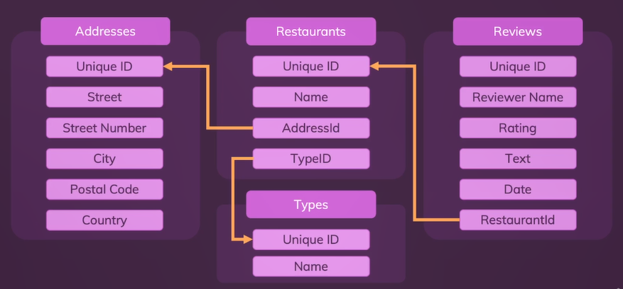

# **Day 58** <!-- omit in toc -->

1. [**Tables**](#tables)
   1. [**Create Table**](#create-table)
   2. [**Adding Fields**](#adding-fields)
   3. [**Inserting Data**](#inserting-data)
   4. [**Display Data**](#display-data)
      1. [**Select All**](#select-all)
      2. [**Select specific Columns**](#select-specific-columns)
      3. [**Select Conditionally**](#select-conditionally)
   5. [**Update Data**](#update-data)
   6. [**Delete Data**](#delete-data)
   7. [**Delete Table**](#delete-table)
2. [**Aggregate Functions**](#aggregate-functions)
   1. [**Count**](#count)
   2. [**Sum**](#sum)
   3. [**Average**](#average)
3. [**Complex Structure**](#complex-structure)

## **Tables**

### **Create Table**

1. Open MySQL Workbench.
2. Select Schema where table need to be added.
3. Expand the schema.
4. Right-click on `Tables`.
5. Select `Create Table`.
6. Name the table (all lowercase, separated by underscore and plural). eg. `restaurants`

### **Adding Fields**

1. Double click on `Column Name`.
2. Add the column name of your choice. eg. `id`.
3. Select the database type.
    - **INT** - For storing integers.
    - **VARCHAR** - Stores String values.
    - **Date** - Stores date without time.
    - **Text** - Stores long strings/text.
    - **Decimal** - Stores Numbers with less precisions.
    - **Float** - Stores Numbers with more precisions.
    - **Boolean** - Stores boolean value.
4. Select the constraints for the column.
    - **PK** - Primary Key (Column for uniquely identifying a row from the table). eg. `id`
    - **NN** - Not Null. (Doesn't allow null/empty value to be stored)
    - **UQ** - Unique (Doesn't allow to stor duplicate value in the column). eg. `email`
    - **AI** - Auto Increment (Increments the value for each newly inserted row). eg. `id`
5. Click Apply -> Apply -> Finish.

**Equivalent SQL Query**

```sql
CREATE TABLE `restaurants_finder`.`restaurants` (
  `id` INT NOT NULL AUTO_INCREMENT,
  `name` VARCHAR(255) NOT NULL,
  `type` VARCHAR(255) NOT NULL,
  PRIMARY KEY (`id`));
```

### **Inserting Data**

```sql
INSERT INTO restaurants_finder.restaurants (name, type) VALUES ("Web Dev Mealery", "German");
```

-   `INSERT INTO` defines that something needs to be inserted.
-   `restaurants_finder` is the database/schema name. Optional to add if you are currently in the same schema.
-   `restaurants` is the name of the table to which value is to be inserted.
-   `(name, type)` are the columns from the _restaurants_ table.
-   `VALUES` adds the values defined in the respected columns.
-   Order of the values should match the column names defined in the query.

### **Display Data**

#### **Select All**

```sql
SELECT * FROM restaurants;
```

-   `SELECT` selects and returns the result as a table.
-   `*` means select all the rows and columns from the table.
-   You can specify the column names that should be displayed.
-   `FROM` tells what table the values should be selected.
-   `restaurants` is the table name.

#### **Select specific Columns**

```sql
SELECT name, type FROM restaurants;
```

-   `name` & `type` are the names of the columns to be displayed
-   Multiple columns are separated by `,` (comma)

#### **Select Conditionally**

```sql
SELECT * FROM restaurants WHERE type="German";
```

-   `=` is used to compare the value from the `type` column which is `German`
-   Multiple conditions can be added with `AND` and `OR` keywords.
-   It doesn't modify the original data from the database.

### **Update Data**

```sql
UPDATE restaurants SET name = "Web Dev Meals" WHERE name = "Web Dev Mealery";
```

-   `SET` is used to se the updated value. Without any condition all the rows from that column will be set to the value specified.

### **Delete Data**

```sql
DELETE FROM restaurants WHERE id = 1;
```

-   `DELETE` can delete one or all rows from the table.

### **Delete Table**

```sql
DROP TABLE restaurants;
```

-   Deletes the entire table form the database along with it's values.

## **Aggregate Functions**

### **Count**

```sql
SELECT COUNT(*) FROM restaurants WHERE type="German";
```

-   `COUNT` returns the number of rows being selected by SELECT.
-   `*` means count the number of rows including all columns.

### **Sum**

-   Returns sum of all the values in the column.

```sql
SELECT SUM(salary) FROM employees;
```

### **Average**

-   Returns average of all the values in the column.

```sql
SELECT AVG(salary) FROM employees;
```

## **Complex Structure**

-   **Schema to be Created**



```sql
CREATE TABLE addresses (
    id INT NOT NULL AUTO_INCREMENT,
    street VARCHAR(255) NOT NULL,
    street_number VARCHAR(45) NOT NULL,
    city VARCHAR(255) NOT NULL,
    postal_code INT NOT NULL,
    country VARCHAR(255),

    PRIMARY KEY (id)
);

CREATE TABLE types (
    id INT NOT NULL AUTO_INCREMENT,
    name VARCHAR(255) NOT NULL,

    PRIMARY KEY (id)
);
```
