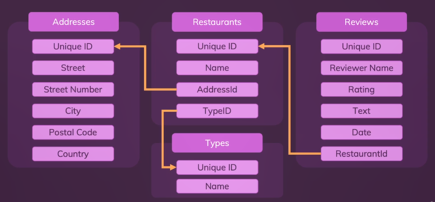
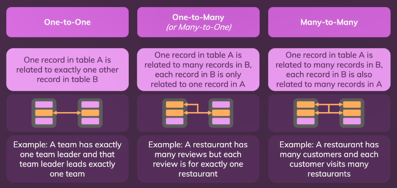

# **Day 59** <!-- omit in toc -->

1. [**Foreign Key**](#foreign-key)
2. [**Default Values**](#default-values)
3. [**Inserting Related Data**](#inserting-related-data)
4. [**Joining Related Data**](#joining-related-data)
5. [**Alias**](#alias)
6. [**Relation Types**](#relation-types)
   1. [**One to One**](#one-to-one)
   2. [**One to Many**](#one-to-many)
   3. [**Many to Many**](#many-to-many)

-   **Schema to be Created**



-   Creating Relations

```sql
CREATE TABLE addresses (
    id INT NOT NULL AUTO_INCREMENT,
    street VARCHAR(255) NOT NULL,
    street_number VARCHAR(45) NOT NULL,
    city VARCHAR(255) NOT NULL,
    postal_code INT NOT NULL,
    country VARCHAR(255),

    PRIMARY KEY (id)
);

CREATE TABLE types (
    id INT NOT NULL AUTO_INCREMENT,
    name VARCHAR(255) NOT NULL,

    PRIMARY KEY (id)
);
```

## **Foreign Key**

-   A field (column) that references a field in another table.
-   `FOREIGN KEY` is used as keyword that takes a column from the current table and links it with a column form another table using `REFERENCES` keyword along with table name to be referenced.

**Syntax**

```sql
CREATE TABLE table_name (
    referenced_id INT,
    FOREIGN KEY (referenced_id) REFERENCES some_other_table(some_id)
);
```

```sql
CREATE TABLE restaurants (
    id INT NOT NULL AUTO_INCREMENT,
    name VARCHAR(255) NOT NULL,
    address_id INT NOT NULL,
    type_id INT NOT NULL,

    PRIMARY KEY (id),
    FOREIGN KEY (address_id) REFERENCES addresses(id),
    FOREIGN KEY (type_id) REFERENCES types(id)
);
```

-   Columns that store referenced values `address_id` & `type_id` should be assigned the same datatype as defined in their original table from which they are referenced.

## **Default Values**

-   Assigns a predefined value if the value to be inserted isn't defined.

```sql
CREATE TABLE reviews (
    id INT NOT NULL AUTO_INCREMENT,
    reviewer_name VARCHAR(255) NOT NULL,
    rating INT NOT NULL,
    text TEXT,
    date DATETIME DEFAULT CURRENT_TIMESTAMP NOT NULL,
    restaurant_id INT NOT NULL,

    PRIMARY KEY (id),
    FOREIGN KEY (restaurant_id) REFERENCES restaurants(id)
);
```

## **Inserting Related Data**

```sql
INSERT INTO types(name) VALUES ("Italian");
INSERT INTO types(name) VALUES ("American");
INSERT INTO types(name) VALUES ("German");
INSERT INTO types(name) VALUES ("Austrian");

INSERT INTO addresses (street, street_number, city, postal_code, country) VALUES (
    "Teststreet",
    "23a",
    "Munich",
    81541,
    "Germany"
);
INSERT INTO addresses (street, street_number, city, postal_code, country) VALUES (
    "Greatstreet",
    "12",
    "Berlin",
    10115,
    "Germany"
);

INSERT INTO restaurants (name, address_id, type_id) VALUES ("Schnitzelhaus", 1, 3);
INSERT INTO restaurants (name, address_id, type_id) VALUES ("Burgerhouse", 1, 2);
INSERT INTO restaurants (name, address_id, type_id) VALUES ("La Mama", 2, 3);

INSERT INTO reviews(rating, restaurant_id, reviewer_name, text) VALUES (
    4,
    2,
    "Niko",
    "This was awesome!"
);
INSERT INTO reviews(rating, restaurant_id, reviewer_name) VALUES (
    2,
    2,
    "Jules Barnes"
);
INSERT INTO reviews(rating, restaurant_id, reviewer_name, text) VALUES (
    4,
    3,
    "Jules Barnes",
    "This was delicious!"
);
INSERT INTO reviews(rating, restaurant_id, reviewer_name, text) VALUES (
    5,
    3,
    "Anna Schulz",
    "Amazing!"
);
```

## **Joining Related Data**

-   Related data can be joined with `JOIN`.
-   Most common type of `JOIN` used is `INNER JOIN`.
-   The result of `JOIN` doesn't modify the table, instead shows it.
-   You can have multiple joins in a query.

```sql
SELECT restaurants.id,
    restaurants.name,
    addresses.*
FROM restaurants
    INNER JOIN addresses ON restaurants.address_id = addresses.id;
```

```sql
SELECT restaurants.id,
    restaurants.name,
    addresses.*,
    types.name
FROM restaurants
    INNER JOIN addresses ON restaurants.address_id = addresses.id
    INNER JOIN types ON restaurants.type_id = types.id;
```

```sql
SELECT reviews.id,
    reviews.reviewer_name,
    reviews.rating,
    reviews.text,
    reviews.date,
    restaurants.name as restaurant_name,
    types.name AS type_name,
    addresses.street,
    addresses.street_number,
    addresses.city,
    addresses.postal_code,
    addresses.country
FROM reviews
    INNER JOIN restaurants ON reviews.restaurant_id = restaurants.id
    INNER JOIN types ON restaurants.type_id = types.id
    INNER JOIN addresses ON restaurants.address_id = addresses.id;
```

## **Alias**

-   While displaying the result set you might want to display a different name to a field.
-   Alias can be assigned to any field in the result set using `AS` keyword.

```sql
SELECT name AS type_name FROM types;
```

---

## **Relation Types**

### **One to One**

-   One record in table A belongs to exactly one record in table B.
-   eg. One team has only one team leader and that team leads exactly one team.

### **One to Many**

-   One record in table A is related to many records in table B, each record in table B is only related to one in table A.
-   eg. A restaurant has many reviews but each review is for exactly one restaurant.

### **Many to Many**

-   One record in table A in related to many records in table B, each record in table B is also related to many records in table A
-   eg. A teacher teaches many classes and a class has many teachers.


