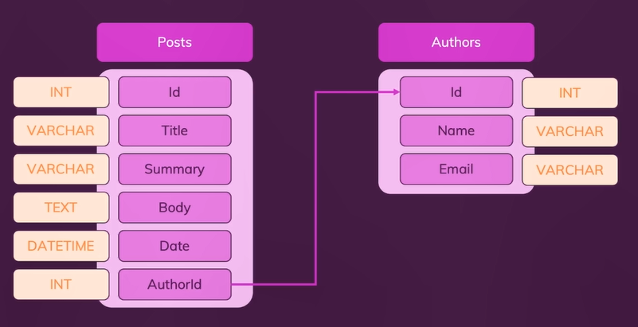

# **Day 60** <!-- omit in toc -->

1. [**Why Connect the Database on the Backend?**](#why-connect-the-database-on-the-backend)
2. [**Using MySQL with NodeJS: Blog**](#using-mysql-with-nodejs-blog)
   1. [**Creating Database Schema**](#creating-database-schema)
   2. [**Inserting Initial Sample Data**](#inserting-initial-sample-data)
   3. [**Creating Routes**](#creating-routes)

## **Why Connect the Database on the Backend?**

-   All front-end code (HTML, CSS & browser-side JavaScript) is exposed to your website visitors with dev tools.
-   Database credentials and and queries can be looked up and edited.
-   Hence, you should not connect to a database from inside your front-end.

---

## **Using MySQL with NodeJS: Blog**

### **Creating Database Schema**



```sql
CREATE authors (
    id int NOT NULL PRIMARY KEY AUTO_INCREMENT,
    name VARCHAR(255) NOT NULL,
    email VARCHAR(255) NOT NULL
);
CREATE TABLE posts(
    id int NOT NULL PRIMARY KEY AUTO_INCREMENT,
    title VARCHAR(255) NOT NULL,
    summary VARCHAR(255) NOT NULL,
    body TEXT NOT NULL,
    date DATETIME DEFAULT CURRENT_TIMESTAMP,
    author_id INT NOT NULL,
    FOREIGN KEY (author_id) REFERENCES authors(id)
);
```

### **Inserting Initial Sample Data**

```sql
INSERT INTO blog.authors (name, email)
VALUES ("Niko Bellic", "niko@email.com");
INSERT INTO blog.authors (name, email)
VALUES ("Roman Bellic", "roman@email.com");
```

### **Creating Routes**

`/routes/blog.js`

```javascript
const express = require("express");

const router = express.Router();

router.get("/", function (req, res) {
    res.redirect("/posts");
});

router.get("/posts", function (req, res) {
    res.render("posts-list");
});

router.get("/new-post", function (req, res) {
    res.render("create-post");
});

module.exports = router;
```
