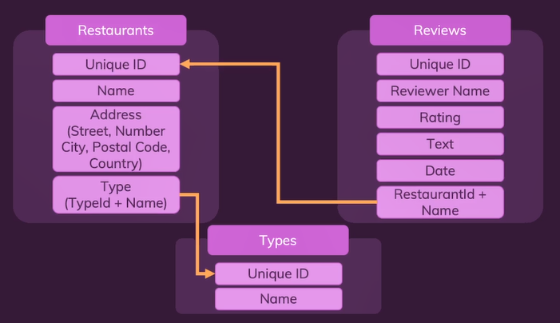

# **Day 64** <!-- omit in toc -->

1. [**Reading**](#reading)
   1. [**All Documents**](#all-documents)
   2. [**Filter Documents**](#filter-documents)
   3. [**Specific Field**](#specific-field)
   4. [**One Document**](#one-document)
2. [**Updating**](#updating)
   1. [**One Document**](#one-document-1)
   2. [**All Documents**](#all-documents-1)
3. [**Delete**](#delete)
   1. [**One Document**](#one-document-2)
   2. [**All Documents**](#all-documents-2)
4. [**Operators**](#operators)
   1. [**Arithmetic Operators**](#arithmetic-operators)
   2. [**Logical Operator**](#logical-operator)
5. [**Database Planning**](#database-planning)
   1. [**Types**](#types)
   2. [**Restaurants**](#restaurants)
   3. [**Reviews**](#reviews)

## **Reading**

### **All Documents**

-   `find()` without any parameter is used to get all the documents.
-   It returns an _array_ of documents.

```
db.restaurants.find()
```

**Result**

```
[   _id: ObjectId("61c9e66bda27de81c0564749"),
  {
    _id: ObjectId("61c9e698da27de81c056474a")
    name: 'Munich House',
    address: { street: 'Some Street', streetNumber: '23b' }
  },
  {
    _id: ObjectId("61c9e6a2da27de81c056474b"),
    name: 'Burger House',
    address: { street: 'Another Street', streetNumber: '15' }
  }
]
```

### **Filter Documents**

-   Parameters are passed to filter the data to be displayed.
-   Parameters are in the form of objects.
-   The field is used followed by a colon and the value to which the data is to be filtered.

```
db.restaurants.find({ name: "Munich House"})
```

**Result**

```
[
  {
    _id: ObjectId("61c9e698da27de81c056474a"),
    name: 'Munich House',
    address: { street: 'Some Street', streetNumber: '23b' }
  }
]
```

### **Specific Field**

-   Second parameter in `find()` is used to set which fields to be shown or hide.
-   It again contains key-value pairs.
-   Property name has to be given a value, either 0 or 1.
-   `0` - to hide the field form the result set.
-   `1` - to show the field form the result set.

```
db.restaurants.find({}, {name: 1, _id: 0})
```

**Result**

```
[
  { name: 'Munich House' },
  { name: 'Burger House' }
]
```

### **One Document**

-   Returns a single document object instead of the array of documents.
-   Only the first match will be displayed with the help of `findOne()`.

```
db.restaurants.findOne({ name: "Munich House" })
```

**Result**

```
{
  _id: ObjectId("61c9e698da27de81c056474a"),
  name: 'Munich House',
  address: { street: 'Some Street', streetNumber: '23b' }
}
```

---

## **Updating**

### **One Document**

-   Updates only one document at a time.
-   `$set` property/operator is used to define the updated value.
-   Nested values can also be updated by mentioning their location.

**Before**

```
db.restaurants.findOne(
    {
        _id: ObjectId("61c9e698da27de81c056474a")
    }
)

<!-- Result -->
{
  _id: ObjectId("61c9e698da27de81c056474a"),
  name: 'Munich House',
  address: { street: 'Some Street', streetNumber: '23b' }
}
```

**Update Command**

```
db.restaurants.updateOne(
    {
        _id: ObjectId("61c9e698da27de81c056474a")
    }, {
        $set: {
            "address.street": "Some Other Street"
        }
    }
)

<!-- Result -->
{
  acknowledged: true,
  insertedId: null,
  matchedCount: 1,
  modifiedCount: 1,
  upsertedCount: 0
}
```

**After**

```
db.restaurants.findOne({_id: ObjectId("61c9e698da27de81c056474a")})

{
    _id: ObjectId("61c9e698da27de81c056474a"),
    name: 'Munich House',
    address: {
        street: 'Some Other Street',
        streetNumber: '23b'
    }
}
```

### **All Documents**

-   Works similar to `updateOne()` except it updates multiple documents at the same time.

**Before**

```
[
  {
    _id: ObjectId("61c9e698da27de81c056474a"),
    name: 'Munich House',
    address: { street: 'Some Other Street', streetNumber: '23b' }
  },
  {
    _id: ObjectId("61cb2dc38f33b5dbfe5038a3"),
    name: 'Two',
    address: { street: 'Some Other Street' }
  }
]
```

**Update Many Command**

```
db.restaurants.updateMany({}, { $set: { "address.country": "USA" } })

<!-- Result -->
{
  acknowledged: true,
  insertedId: null,
  matchedCount: 2,
  modifiedCount: 2,
  upsertedCount: 0
}
```

**After**

```
[
  {
    _id: ObjectId("61c9e698da27de81c056474a"),
    name: 'Munich House',
    address: {
      street: 'Some Other Street',
      streetNumber: '23b',
      country: 'USA'
    }
  },
  {
    _id: ObjectId("61cb2dc38f33b5dbfe5038a3"),
    name: 'Two',
    address: { street: 'Some Other Street', country: 'USA' }
  }
]
```

---

## **Delete**

### **One Document**

-   Only deletes the first matching document.

```
db.restaurants.deleteOne(
    {
        _id: ObjectId("61c9e6a2da27de81c056474b")
    }
)

<!-- Result -->
{ acknowledged: true, deletedCount: 1 }
```

### **All Documents**

-   Similar to `deleteOne()` but it deletes all the documents from the result set.

**Before**

```
db.restaurants.find()
[
  {
    _id: ObjectId("61cb2db48f33b5dbfe5038a2"),
    name: 'One',
    address: { street: 'Some Street' }
  },
  {
    _id: ObjectId("61cb2dc38f33b5dbfe5038a3"),
    name: 'Two',
    address: { street: 'Some Other Street' }
  },
  {
    _id: ObjectId("61cb2dcd8f33b5dbfe5038a4"),
    name: 'Three',
    address: { street: 'Some Street' }
  }
]
```

```
db.restaurants.deleteMany(
    {
        "address.street": "Some Street"
    }
)

<!-- Result -->
{ acknowledged: true, deletedCount: 2 }
```

**After**

```
[
  {
    _id: ObjectId("61c9e698da27de81c056474a"),
    name: 'Munich House',
    address: { street: 'Some Other Street', streetNumber: '23b' }
  },
  {
    _id: ObjectId("61cb2dc38f33b5dbfe5038a3"),
    name: 'Two',
    address: { street: 'Some Other Street' }
  }
]
```

---

## **Operators**

-   More types of operators can be found in [MOngoDB Docs](https://docs.mongodb.com/manual/reference/operator/query/)

### **Arithmetic Operators**

-   `$eq` - display documents which has values equal to specified value.
-   `$ne` - display documents which has values not equal to specified value.
-   `$lt` - display documents which has values less than specified value.
-   `$gt` - display documents which has values greater than specified value.
-   `$lte` - display documents which has values less than or equal to specified value.
-   `$gte` - display documents which has values greater than or equal to specified value.

```
db.reviews.find({ rating: { $gt: 4 }})
```

### **Logical Operator**

-   `$and` - Join query clauses that matches conditions of both the clauses.
-   `$or` - Join query clauses that returns all the documents that match the conditions of either clause.
-   `$not` - Inverts the effect of a query and return documents that do not match the query expression.
-   `$nor` - Join query clauses that returns all the documents that fails to match both the conditions.

```
db.reviews.find({ $and: [{ rating: { $gt: 1 }, { rating: { $lt: 3 } }}]})
```

---

## **Database Planning**



### **Types**

```
db.types.insertOne({ name: "German" })
db.types.insertOne({ name: "Italian" })
db.types.insertOne({ name: "American" })

[
  { _id: ObjectId("61cb36348f33b5dbfe5038a5"), name: 'German' },
  { _id: ObjectId("61cb36358f33b5dbfe5038a6"), name: 'Italian' },
  { _id: ObjectId("61cb36368f33b5dbfe5038a7"), name: 'American' }
]
```

### **Restaurants**

```
db.restaurants.insertOne(
    {
        name: "Munich House",
        address: {
            street: "FoodStreet",
            streetNumber: "23b",
            postalCode: 80333,
            city: "Munich",
            country: "Germany"
        },
        type: {
            typeId: ObjectId("61cb36348f33b5dbfe5038a5"),
            name: "German"
        }
    }
)

db.restaurants.insertOne(
    {
        name: "Berlin Burger House",
        address: {
            street: "HamStreet",
            streetNumber: "12",
            postalCode: 10115,
            city: "Berlin",
            country: "Germany"
        },
        type: {
            typeId: ObjectId("61cb36368f33b5dbfe5038a7"),
            name: "American"
        }
    }
)

<!-- Results -->
[
  {
    _id: ObjectId("61cb3c0b8f33b5dbfe5038a8"),
    name: 'Munich House',
    address: {
      street: 'FoodStreet',
      streetNumber: '23b',
      postalCode: 80333,
      city: 'Munich',
      country: 'Germany'
    },
    type: { typeId: ObjectId("61cb36348f33b5dbfe5038a5"), name: 'German' }
  },
  {
    _id: ObjectId("61cb3c858f33b5dbfe5038a9"),
    name: 'Berlin Burger House',
    address: {
      street: 'HamStreet',
      streetNumber: '12',
      postalCode: 10115,
      city: 'Berlin',
      country: 'Germany'
    },
    type: { typeId: ObjectId("61cb36368f33b5dbfe5038a7"), name: 'American' }
  }
]
```

### **Reviews**

```
db.reviews.insertOne({
    reviewer: {
        firstName: "Niko",
        lastName: "Bellic"
    },
    rating: 3,
    text: "This was okay - could be better!",
    date: new Date("2021-12-28"),
    restaurant: {
        id: ObjectId("61cb3c0b8f33b5dbfe5038a8"),
        name: "Munich House"
    }
})

db.reviews.insertOne({
    reviewer: {
        firstName: "Niko",
        lastName: "Bellic"
    },
    rating: 5,
    text: "This was amazing!",
    date: new Date("2021-12-28"),
    restaurant: {
        id: ObjectId("61cb3c858f33b5dbfe5038a9"),
        name: "Berlin Burger House House"
    }
})

<!-- Result -->
[
  {
    _id: ObjectId("61cb3fb88f33b5dbfe5038aa"),
    reviewer: { firstName: 'Niko', lastName: 'Bellic' },
    rating: 3,
    text: 'This was okay - could be better!',
    date: ISODate("2021-12-28T00:00:00.000Z"),
    restaurant: { id: ObjectId("61cb3c0b8f33b5dbfe5038a8"), name: 'Munich House' }
  },
  {
    _id: ObjectId("61cb40c08f33b5dbfe5038ab"),
    reviewer: { firstName: 'Niko', lastName: 'Bellic' },
    rating: 5,
    text: 'This was amazing!',
    date: ISODate("2021-12-28T00:00:00.000Z"),
    restaurant: {
      id: ObjectId("61cb3c858f33b5dbfe5038a9"),
      name: 'Berlin Burger House House'
    }
  }
]
```
