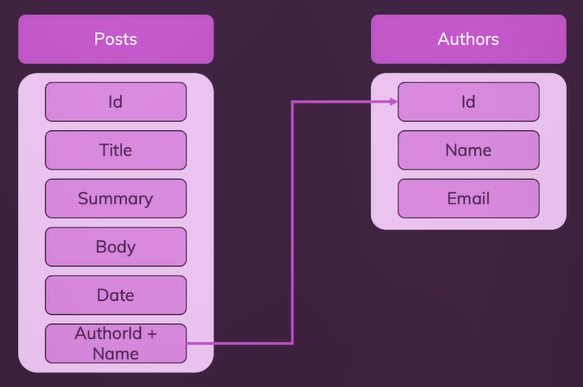

# **Day 65** <!-- omit in toc -->

1. [**Creating Blogs Website**](#creating-blogs-website)
   1. [**Planning Database**](#planning-database)
   2. [**Creating Database Structure**](#creating-database-structure)
   3. [**Connecting to Database**](#connecting-to-database)
   4. [**Fetching Data**](#fetching-data)
   5. [**Inserting Data**](#inserting-data)

## **Creating Blogs Website**

### **Planning Database**



### **Creating Database Structure**

```shell
$ npm install mongodb
```

```
use blogs

db.authors.insertMany(
    [
        {
            name: "Niko Bellic",
            email: "niko@email.com"
        },
        {
            name: "Roman Bellic",
            email: "roman@email.com"
        }
    ]
)
```

### **Connecting to Database**

**`/data/database.js`**

```javascript
const mongodb = require("mongodb");

const MongoClient = mongodb.MongoClient;

let database;

async function connect() {
    // Creating Connection
    const client = await MongoClient.connect("mongodb://localhost:27017");
    // Connecting to "blog" Database
    database = client.db("blog");
}

function getDb() {
    if (!database) {
        throw {
            message: "Database connection not established!",
        };
    }
    return database;
}

module.exports = {
    connectToDatabase: connect,
    getDb: getDb,
};
```

**`/app.js`**

```javascript
...
const db = require("./data/database");

// Only Listen if database is connected
db.connectToDatabase().then(function () {
    app.listen(3000);
});
...
```

### **Fetching Data**

```javascript
router.get("/new-post", async function (req, res) {
    // Access "authors" collection
    // `toArray()` will get all the authors. If not used then returns cursor (data in chunks)
    const authors = await db.getDb().collection("authors").find().toArray();

    // Passing data to the template
    res.render("create-post", { authors: authors });
});
```

### **Inserting Data**

**`/views/create-post.ejs`**

```html
...
<form action="/posts" method="POST">
    <div class="form-control">
        <label for="title">Title</label>
        <input type="text" id="title" name="title" required />
    </div>
    <div class="form-control">
        <label for="summary">Summary</label>
        <input
            type="text"
            id="summary"
            name="summary"
            required
            maxlength="255"
        />
    </div>
    <div class="form-control">
        <label for="content">Post Content</label>
        <textarea id="content" name="content" required rows="5"></textarea>
    </div>
    <div class="form-control">
        <label for="author">Select Author</label>
        <select id="author" name="author">
            <% for (const author of authors) { %>
            <option value="<%= author._id %>"><%= author.name %></option>
            <% } %>
        </select>
    </div>
    <button class="btn">Add Post</button>
</form>
...
```

**`/router/blog.js`**

```javascript
router.post("/posts", async function (req, res) {
    // Get author ID
    const authorId = new ObjectId(req.body.author);

    // Get author details from the database
    const author = await db
        .getDb()
        .collection("authors")
        .findOne({ _id: authorId });

    // Create post object to be stored
    const newPost = {
        title: req.body.title,
        summary: req.body.summary,
        body: req.body.content,
        date: new Date(),
        author: {
            id: authorId,
            name: author.name,
            email: author.email,
        },
    };

    // Insert newly created post
    const result = await db.getDb().collection("posts").insertOne(newPost);

    res.redirect("/posts");
});
```
