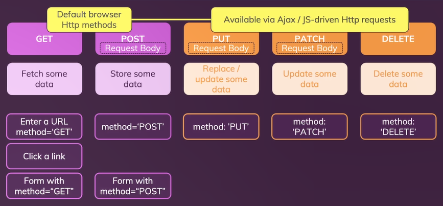

# **Day 69** <!-- omit in toc -->

1. [**AJAX Requests**](#ajax-requests)
   1. [**Server-Side Changes**](#server-side-changes)
   2. [**GET Request**](#get-request)
   3. [**POST Request**](#post-request)
   4. [**Error Handling**](#error-handling)
      1. [**Server-Side Error**](#server-side-error)
      2. [**Client-Side Error**](#client-side-error)
2. [**HTTP Methods**](#http-methods)
   1. [**GET**](#get)
   2. [**POST**](#post)
   3. [**PUT**](#put)
   4. [**PATCH**](#patch)
   5. [**DELETE**](#delete)

## **AJAX Requests**

### **Server-Side Changes**

-   We need to use a special middleware in order to fetch the JSON requests.
-   `express.json()` is such a method which parses the incoming JSON requests.
-   `res.json()` on the response _(res)_ object allows to send back the response in JSON format.

**`/app.js`**

```javascript
app.use(express.json()); // Parse incoming json requests
```

**`/routes/blog.js`**

```javascript
router.get("/posts/:id/comments", async function (req, res) {
    const postId = new ObjectId(req.params.id);
    const comments = await db
        .getDb()
        .collection("comments")
        .find({ postId: postId })
        .toArray();

    // Return all the comments
    res.json(comments);
});

router.post("/posts/:id/comments", async function (req, res) {
    const postId = new ObjectId(req.params.id);
    const newComment = {
        postId: postId,
        title: req.body.title,
        text: req.body.text,
    };
    await db.getDb().collection("comments").insertOne(newComment);

    // Return success response
    res.json({ message: "Comment added!" });
});
```

**`/views/post-details.ejs`**

```html
<html lang="en">
    <head>
        ...
        <script src="/scripts/comments.js" defer></script>
    </head>

    <body>
        ...
        <section id="comments">
            <p>
                This post might have comments. You can load them if you want to
                view them.
            </p>
            <button
                class="btn btn-alt"
                id="load-comments-btn"
                data-postid="<%= post._id %>"
            >
                Load Comments
            </button>
        </section>
        <section id="comments-form">
            <h2>Leave a comment</h2>
            <form data-postid="<%= post._id %>">...</form>
        </section>
        ...
    </body>
</html>
```

### **GET Request**

-   `fetch()` when used by default sends a _"GET"_ request to the endpoint.
-   `fetch()` also returns a promise.

**`/public/scripts/comments.js`**

```javascript
const loadCommentsBtnElement = document.getElementById("load-comments-btn");
const commentsSectionElement = document.getElementById("comments");

function createCommentsList(comments) {
    const commentListElement = document.createElement("ol");

    for (const comment of comments) {
        const commentElement = document.createElement("li");
        commentElement.innerHTML = `
        <article class="comment-item">
            <h2>${comment.title}</h2>
            <p>${comment.text}</p>
        </article>
        `;
        commentListElement.appendChild(commentElement);
    }

    return commentListElement;
}

async function fetchCommentsPost() {
    // Get Post Id from Button's data attribute
    const postId = loadCommentsBtnElement.dataset.postid;

    // Fetch comments
    const response = await fetch(`/posts/${postId}/comments`);
    const responseData = await response.json();

    // Render list if comments exists
    if (responseData && responseData.length > 0) {
        // Send back comments
        const commentsListElement = createCommentsList(responseData);
        commentsSectionElement.innerHTML = "";
        commentsSectionElement.appendChild(commentsListElement);
    } else {
        commentsSectionElement.firstElementChild.textContent =
            "We could not find any comment. Maybe add one?";
    }
}

loadCommentsBtnElement.addEventListener("click", fetchCommentsPost);
```

### **POST Request**

-   `fetch()` can include a second parameter in the form of object to send some data with the request.
-   `headers`: includes the metadata to be sent with the request. _eg. type of content to be sent_
-   `method`: defines the method to be used to send a request. _eg. (GET, POST, PUT, PATCH, DELETE)_
-   `body`: includes the actual data to be sent with the request.

**`/public/scripts/comments.js`**

```javascript
const commentsFormElement = document.querySelector("#comments-form form");
const commentTitleElement = document.getElementById("title");
const commentTextElement = document.getElementById("text");

async function saveComment(event) {
    // Prevent browser default submission
    event.preventDefault();

    // Get values from the form
    const enteredTitle = commentTitleElement.value;
    const enteredText = commentTextElement.value;

    // Create comment Object
    const comment = {
        title: enteredTitle,
        text: enteredText,
    };

    // Get Post Id from form's data attribute
    const postId = commentsFormElement.dataset.postid;

    // Send Comment to the backend
    const response = await fetch(`/posts/${postId}/comments`, {
        headers: {
            "Content-Type": "application/json",
        },
        method: "POST",
        body: JSON.stringify(comment),
    });

    // Fetch Updated comments and display them
    fetchCommentsPost();

    // Clear form inputs
    commentTitleElement.value = "";
    commentTextElement.value = "";
}

commentsFormElement.addEventListener("submit", saveComment);
```

### **Error Handling**

#### **Server-Side Error**

-   eg. Bad Response from the server.
-   `response.ok` is a boolean value returned from the response which can be used to check if the response was success or not.

**`/public/scripts/comments.js`**

```javascript
async function saveComment(event) {
    ...
    // Error Handling
    if (response.ok) {
        // Fetch Updated comments and display them
        fetchCommentsPost();

        // Clear form inputs
        commentTitleElement.value = "";
        commentTextElement.value = "";
    } else {
        alert("Could not send comment!");
    }
}
```

#### **Client-Side Error**

-   eg. Request not sent to the server.
-   These kind of requests could be handled with `try-catch`.

**`/public/scripts/comments.js`**

```javascript
async function fetchCommentsPost() {
    ...
    // Handling Request Not Sent Error
    try {
        // Fetch comments
        const response = await fetch(`/posts/${postId}/comments`);

        // Handle no/bad response
        if (!response.ok) {
            alert("Fetching Comments failed!");
            return;
        }
        ...
    } catch (error) {
        alert("Getting comments failed!");
    }
}

async function saveComment(event) {
    ...
    try {
        // Send Comment to the backend
        const response = await fetch(`/posts/${postId}/comments`, {
            headers: {
                "Content-Type": "application/json",
            },
            method: "POST",
            body: JSON.stringify(comment),
        });

        // Error Handling
        if (response.ok) {
            // Fetch Updated comments and display them
            fetchCommentsPost();

            // Clear form inputs
            commentTitleElement.value = "";
            commentTextElement.value = "";
        } else {
            alert("Could not send comment!");
        }
    } catch (error) {
        alert("Could not send the request - maybe try again later!");
    }
}
```

-   Testing: After the page is loaded, goto _Networks_ tab in Dev Tools and change the behavior from _No Throttling_ to _Offline_

---

## **HTTP Methods**



### **GET**

-   Default browser HTTP Request.
-   Fetch some data.
-   Triggered: Enter a URL, Click a link, Form with "GET" method

### **POST**

-   Default browser HTTP Request.
-   Store some data.
-   Can carry body with request.
-   Triggered: Form with "POST" method.

### **PUT**

-   Available with AJAX / JS-driven HTTP requests.
-   Replace or update some data.
-   Can carry body with request.
-   Triggered: method is "PUT".

### **PATCH**

-   Available with AJAX / JS-driven HTTP requests.
-   Update some (part of the) data.
-   Can carry body with request.
-   Triggered: method is "PATCH".

### **DELETE**

-   Available with AJAX / JS-driven HTTP requests.
-   Delete some data.
-   Triggered: method is "DELETE".
