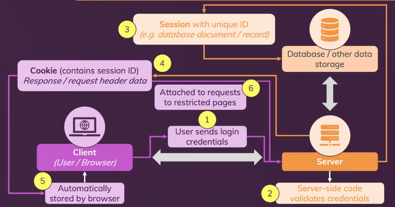

# **Day 70** <!-- omit in toc -->

1. [**User Sign In**](#user-sign-in)
2. [**Adding Sign Up Validation**](#adding-sign-up-validation)
3. [**Sessions & Cookies**](#sessions--cookies)

## **User Sign In**

```javascript
router.post("/login", async function (req, res) {
    const userData = req.body;
    const enteredEmail = userData.email;
    const enteredPassword = userData.password;

    const existingUser = await db
        .getDb()
        .collection("users")
        .findOne({ email: enteredEmail });

    if (!existingUser) {
        console.log("Could not log in!");
        return res.redirect("/login");
    }

    const passwordAreEqual = await bcrypt.compare(
        enteredPassword,
        existingUser.password
    );

    if (!passwordAreEqual) {
        console.log("Could not log in - passwords are not equal!");
        return res.redirect("/login");
    }

    console.log("User is authenticated!");
    res.redirect("/admin");
});
```

## **Adding Sign Up Validation**

```javascript
router.post("/signup", async function (req, res) {
    ...
    // Check for Validation constraints
    if (
        !enteredEmail ||
        !enteredConfirmEmail ||
        !enteredPassword ||
        enteredPassword.trim() < 6 ||
        enteredEmail !== enteredConfirmEmail ||
        !enteredEmail.includes("@")
    ) {
        console.log("Incorrect data");
        return res.redirect("/signup");
    }

    const existingUser = await db
        .getDb()
        .collection("users")
        .findOne({ email: enteredEmail });

    if (existingUser) {
        console.log("User exists already");
        return res.redirect("/signup");
    }
    ...
});
```

## **Sessions & Cookies**



```shell
$ npm install express-session # for sessions
$ npm install connect-mongodb-session # for storing session in MongoDb database
$ npm install cookie-parser # for cookies
```

```javascript
const session = require("express-session");
const mongodbStore = require("connect-mongodb-session");

const MongoDBStore = mongodbStore(session);

const sessionStore = new MongoDBStore({
    uri: "mongodb://localhost:27017", // MongoDB URI
    databaseName: "auth-demo", // Database to be used
    collection: "sessions", // Collection to store the session
});

// Adding session middleware
app.use(
    session({
        secret: "super-secret", // to secure a session
        resave: false, // only update session if session data is changed
        saveUninitialized: false, // only save data if present
        store: sessionStore, // where to store session data (memory/file storage/database)
    })
);
```
