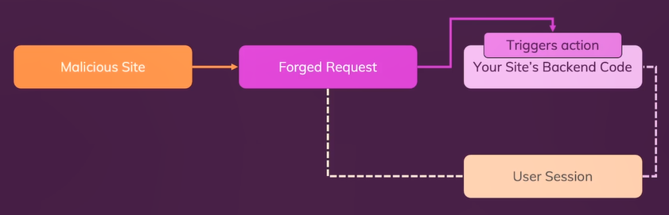
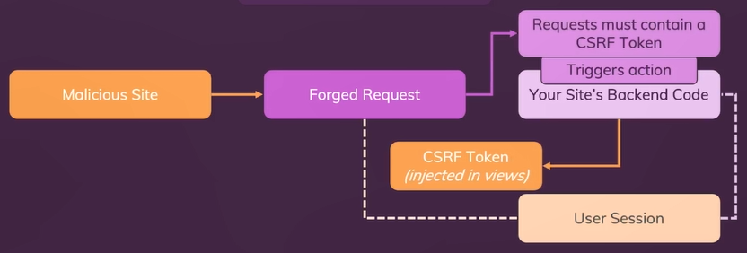
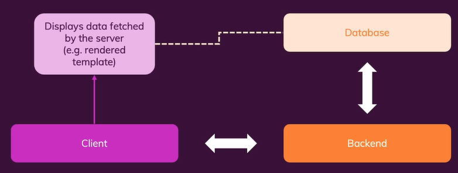
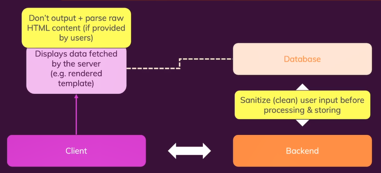

# **Day 74** <!-- omit in toc -->

1. [**Authentication vs Security**](#authentication-vs-security)
2. [**Attack Patters**](#attack-patters)
   1. [**CSRF Attacks**](#csrf-attacks)
      1. [**Implementation**](#implementation)
      2. [**Same-Site Cookie**](#same-site-cookie)
      3. [**Protection**](#protection)
   2. [**XSS Attacks**](#xss-attacks)
      1. [**Implementation**](#implementation-1)
      2. [**Protection**](#protection-1)
         1. [**Escaping**](#escaping)
         2. [**Sanitizing**](#sanitizing)

## **Authentication vs Security**

| Authentication                                   | Security                                                                          |
| :----------------------------------------------- | :-------------------------------------------------------------------------------- |
| Control expected actions by your website visitor | Prevent unexpected (potentially malicious) actions by visitors / other people     |
| Grant some visitors more privileges than others  | Prevent exposing data or granting unwanted access to certain actions or your code |

## **Attack Patters**

### **CSRF Attacks**

-   **C**ross **S**ite **R**equest **F**orgery.
-   A website that looks like an original website is created by the attacker.
-   The requested data entered by the user is modified and sent to the original server.
-   If some cookie has some data that is related to a target URL then it will be sent along with the request even if that request is sent from any other website.



#### **Implementation**

```shell
# Running Main Site
$ cd my-site
$ npm install && start

# Running Attacker's site
$ cd attacker-site
$ npm install && start
```

_Note: Keep the database server running_

1. Visit `localhost:3000/transaction`.
2. Make transaction and see the result in the database.

```sql
db.transactions.find()
```

3. Visit `localhost:8000/transaction`.
4. Make a transaction and check the database again.
5. The data you entered has been modified by the attacker's website and stored in the main website's database.

#### **Same-Site Cookie**

-   Same-site Cookie on [MDN](https://developer.mozilla.org/en-US/docs/Web/HTTP/Headers/Set-Cookie/SameSite).
-   By default it is blocked by most of the browsers but sites running locally are exceptions to this.
-   Can be set with this following:

```javascript
session({
    cookie: {
        sameSite: "lax",
    },
});
```

#### **Protection**

-   Developers can add CSRF Token that are injected in views.
-   These are only known to the server.
-   The requests must contain a valid CSRF Token to trigger action.



-   `csurf` is one of the csrf protection package for express.

```shell
$ npm install csurf
```

**`/app.js`**

```javascript
// Importing "csurf" module
const csrf = require("csrf");

// Adding CSRF as Middleware
app.use(csrf());
```

-   Any requests that manipulate something on your backend should carry a CSRF token.

**`/routes/demo.js`**

```javascript
router.get("/transaction", function (req, res) {
    if (!res.locals.isAuth) {
        return res.status(401).render("401");
    }

    // Creates a CSRF Token that is valid for one request-response cycle
    const csrfToken = req.csrfToken();

    // Passing token to template
    res.render("transaction", { csrfToken });
});
```

**`/views/transaction.ejs`**

```html
<form action="/transaction" method="POST">
    <!-- Hidden Input with CSRF Token with the name "_csrf" -->
    <input type="hidden" name="_csrf" value="<%= csrfToken %>" />

    <div class="form-control">
        <label for="recipient">Recipient Email</label>
        <input type="email" id="recipient" name="recipient" />
    </div>
    <div class="form-control">
        <label for="amount">Amount</label>
        <input type="number" id="amount" name="amount" />
    </div>
    <button class="btn">Send</button>
</form>
```

Follow the same steps as earlier and this time the attacker's website won't be able to send the request to our server since the CSRF token would be missing.

### **XSS Attacks**

-   Stands for Cross Site Scripting.
-   Injecting malicious scripts into content of website.
-   As the attack is been made from the main website by the attacker, the CSRF token would also be know and would be valid.

#### **Implementation**

```html
<script>
    // Some code to be executed by the attacker
    alert("Hacked!");
</script>
```

-   Now, whenever some user opens this webpage the attacker code would get executed automatically.

;

#### **Protection**

##### **Escaping**

-   Don't output and parse raw HTML content that is provided by the user directly.
-   Instead, sanitize the data while it is being submitted and then store it.



-   For the Front-end JavaScript use `element.textContext` instead of `element.innerHTML`.

##### **Sanitizing**

-   Look at the content and remove something that is dangerous.
-   `express-validator` and `xss` are third-part packages that are used for sanitizing Untrusted User Inputs (HTML).

```shell
$ npm install xss
```

**`/routes/discussion.`**

```javascript
const xss = require("xss");

router.post('/discussion/comment', async function (req, res) {
  const comment = {
    text: xss(req.body.comment),
  };
  ....
});
```
