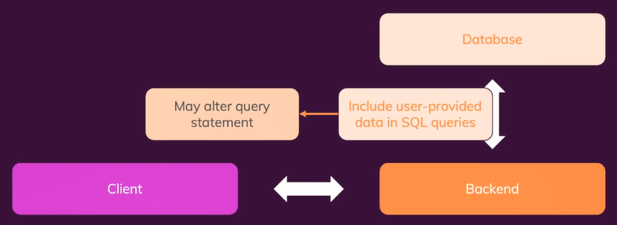
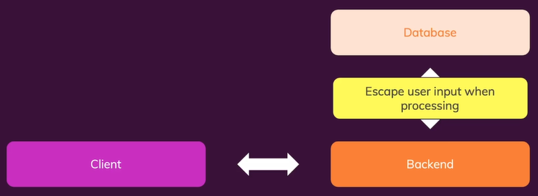

# **Day 75** <!-- omit in toc -->

1. [**SQL Injection**](#sql-injection)
   1. [**Implementation**](#implementation)
   2. [**Protection**](#protection)
2. [**NoSQL Injection**](#nosql-injection)
3. [**Server-side mistakes to avoid**](#server-side-mistakes-to-avoid)
   1. [**Static Files**](#static-files)
   2. [**Errors**](#errors)
4. [**Refactoring**](#refactoring)

## **SQL Injection**

-   Injecting Malicious data by the user.
-   Will include SQL queries which may alter the query statement.



### **Implementation**

1. Create a database with the name `security`.

```sql
CREATE DATABASE security;
```

2. Add a `comments` table with the fields id, author and text.

```sql
CREATE TABLE comments(
    id int NOT NULL PRIMARY KEY AUTO_INCREMENT,
    author VARCHAR(255) NOT NULL,
    text VARCHAR(255) NOT NULL
);
```

3. Goto project directory.
4. Install Dependencies.
5. Modify the MySQL connectivity configuration in `/data/database.js`.
6. Install the dependencies with `npm install`.
7. Launch the project.
8. Enter few sample comments.

```
Name: Niko
Comment: First Comment
Name: Roman
Comment: Second Comment
```

9.  Enter the following text in the Filter by author input: `Roman"; DROP TABLE comments; SELECT * FROM comments WHERE author = "Niko`.

### **Protection**

-   Always escape the user input while processing any data provided by the user.
-   Multiple Statements (Disabled by default)



-   If we use placeholders instead of string literals in the queries then the `mysql2` package will automatically escape the content.

```javascript
filter = `WHERE author = "${req.query.author}"`;
const query = `SELECT * FROM comments ${filter}`;
const [comments] = await db.query(query);
```

```javascript
filter = "WHERE author = ?";
const query = `SELECT * FROM comments ${filter}`;
const [comments] = await db.query(query, [req.query.author]);
```

## **NoSQL Injection**

-   Difficult to perform.
-   Has great security out-of-the-box.

## **Server-side mistakes to avoid**

### **Static Files**

-   Be careful when serving folders (and their content) statically.
-   All files tha are served statically can be requested and viewed without issues.
-   You want that for your CSS, Images and browser-side JS files but not for anything else!

### **Errors**

-   Avoid sending raw error messages to visitors.

## **Refactoring**

-   Breaking your huge code files and logic into individual files that are related to each others.
-   eg. blogs route => users & posts route.
