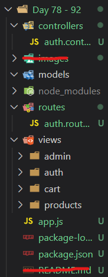

# **Day 78 - 92** <!-- omit in toc -->

1. [**Day 78**](#day-78)
   1. [**Project Planning**](#project-planning)
      1. [**Views**](#views)
      2. [**Models**](#models)
   2. [**Project Structure**](#project-structure)
   3. [**Installing Dependencies**](#installing-dependencies)
2. [**Day 79**](#day-79)
3. [**Day 80**](#day-80)
4. [**Day 81**](#day-81)

# **Day 78**

## **Project Planning**

### **Views**


### **Models**


## **Project Structure**



## **Installing Dependencies**

```shell
$ npm install express # for setting up HTTP server
$ npm install --save-dev nodemon # for restarting server in development
```

---

# **Day 79**

-   Installing EJS
-   Creating Views
-   Importing EJS in Express App
-   Serving EJS files as response
-   Serving Static Content
-   Defining CSS Variables

# **Day 80**

-   Using CSS Variables
-   Styling Form Elements
-   Setting Database Connection

# **Day 81**

-   User SignUp
-   CSRF Protection
-   Error Handling
-   Configuring Session
